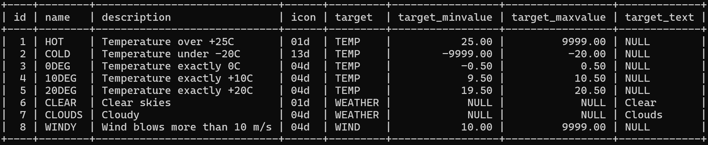
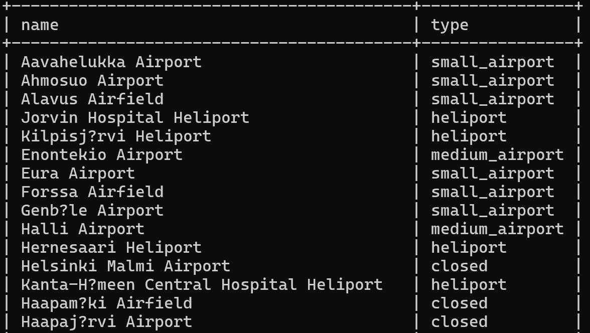
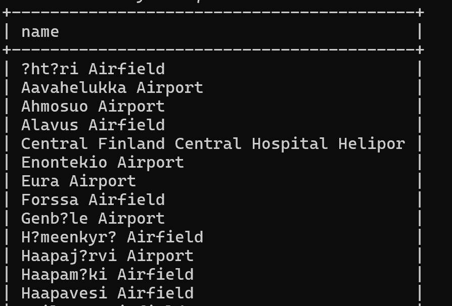
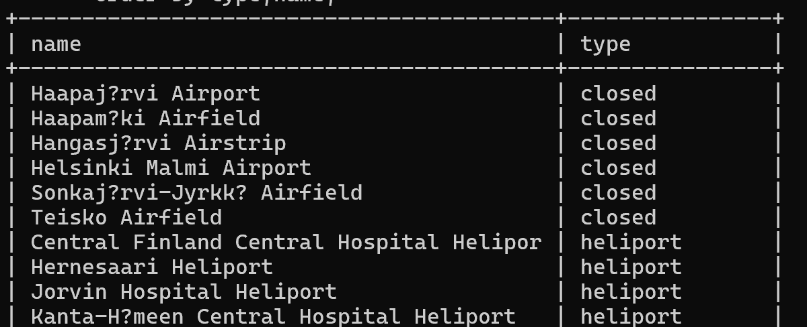
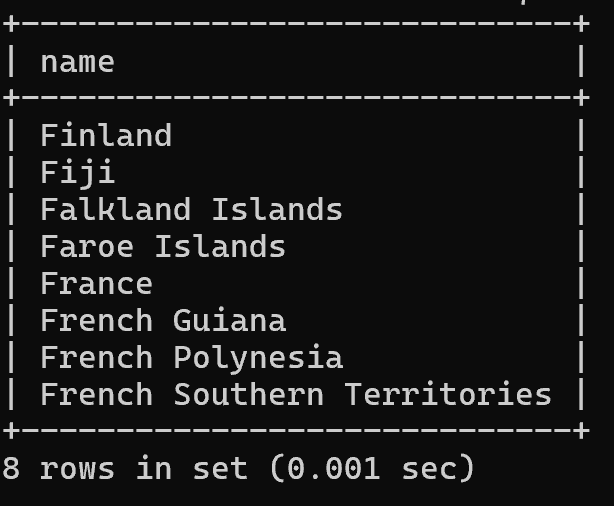
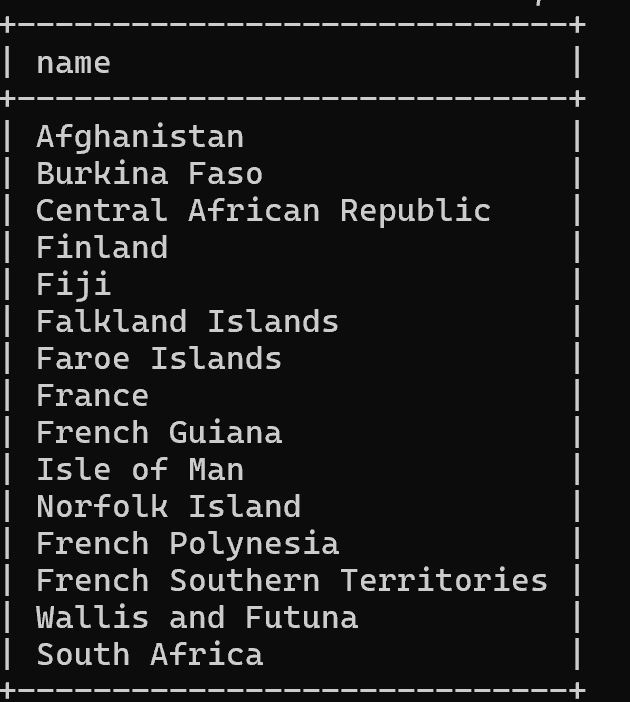
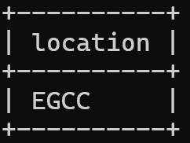
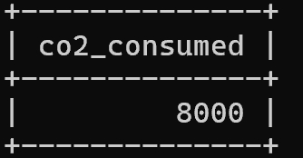
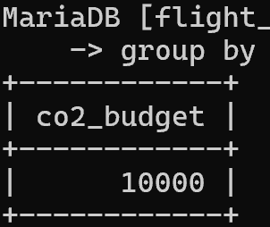
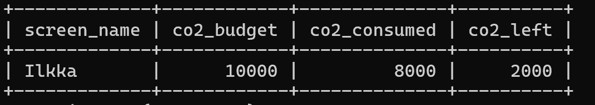

### Exercise 1
select * from goal;

### Exercise 2
select name,type from airport
where iso_country = 'Fi';

### Exercise 3
select name from airport
where iso_country = 'Fi'
order by name;

### Exercise 4
select name,type from airport
where iso_country = "Fi"
order by type,name;

### Exercise 5
select name from country
where name like "F%";

### Exercise 6
select name from country
where name like "%F%";

### Exercise 7
select location from game
where screen_name = "Vesa";

### Exercise 8
select co2_consumed from game
where screen_name = "ilkka";

### Exercise 9
select co2_budget from game
group by co2_budget;

### Exercise 10
select screen_name, co2_budget, co2_consumed,  
(co2_budget-co2_consumed)as co2_left 
from game 
where screen_name = "ilkka";
