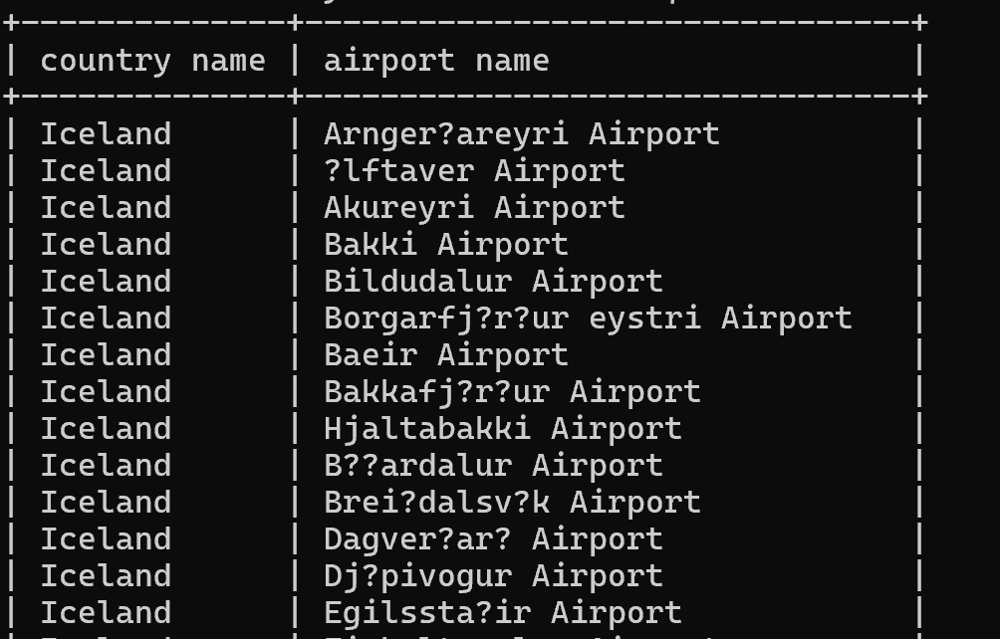
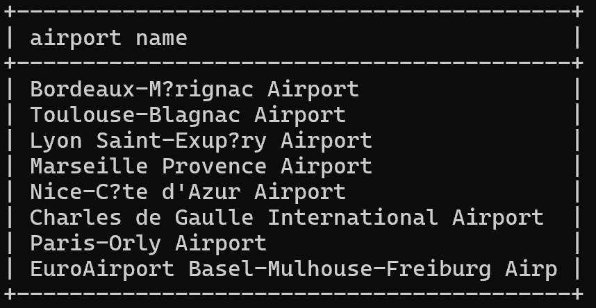
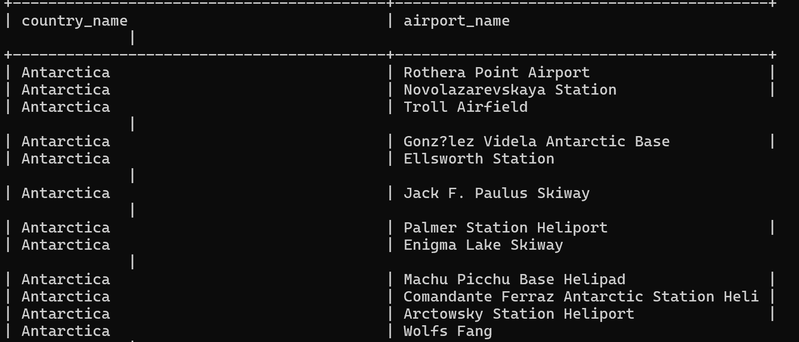
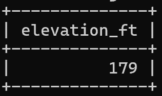
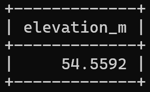
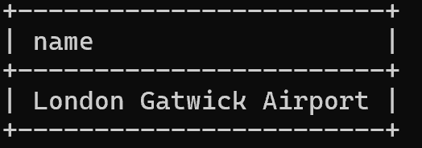
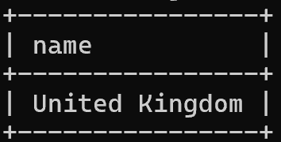
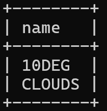
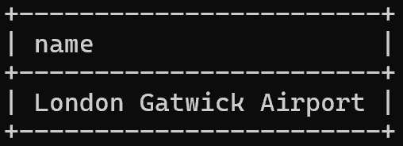
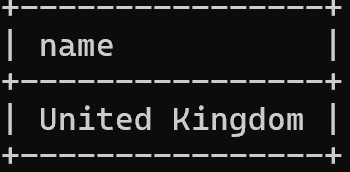

### Exercise 1
select country.name as "country name" ,
airport.name as "airport name" from airport,country
where airport.iso_country = country.iso_country
and country.name = "iceland";

### Exercise 2
select airport.name as "airport name" from airport,country
where airport.iso_country = country.iso_country
and country.name = "France" and airport.type="large_airport";

### Exercise 3
select country.name as "country_name", airport.name as "airport_name" from airport,country
where airport.iso_country = country.iso_country
and country.Continent = "an";

### Exercise 4
select airport.elevation_ft from airport,game
where airport.ident = game.location
and game.screen_name = "heini";

### Exercise 5
select airport.elevation_ft*0.3048 as "elevation_m" from airport,game
where airport.ident = game.location
and game.screen_name = "heini";

### Exercise 6
select name from airport,game
where airport.ident = game.location
and game.screen_name = "ilkka";

### Exercise 7
select country.name from airport,game,country
where airport.ident = game.location
and country.iso_country = airport.iso_country
and game.screen_name = "ilkka";

### Exercise 8
select goal.name from game,goal,goal_reached
where game.id = goal_reached.game_id
and goal_reached.goal_id = goal.id
and game.screen_name = "Heini";

### Exercise 9
select airport.name from game,goal,goal_reached,airport
where game.id = goal_reached.game_id
and goal_reached.goal_id = goal.id
and game.location = airport.ident
and game.screen_name = "ilkka"
and goal.name = "clouds";

### Exercise 10
select country.name from game,goal,goal_reached,airport,country
where game.id = goal_reached.game_id
and goal_reached.goal_id = goal.id
and game.location = airport.ident
and country.iso_country = airport.iso_country
and game.screen_name = "ilkka"
and goal.name = "clouds";

