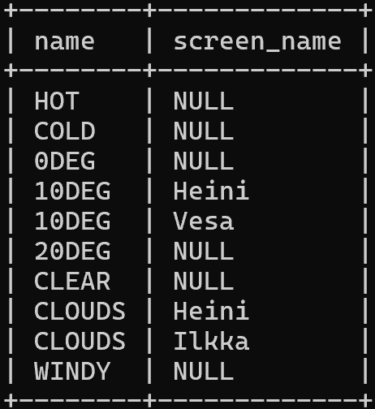

### Exercise 1
select country.name as 'country name', airport.name as 'airport name' from airport,country
where airport.iso_country = country.iso_country
and airport.iso_country = "Fi"
and scheduled_service = 'yes';m

### Exercise 2
SELECT game.screen_name, airport.name FROM game, airport
where airport.ident = game.location

### Exercise 3
SELECT game.screen_name, country.name FROM game, country, airport
where airport.ident = game.location
and airport.iso_country = country.iso_country

### Exercise 4
SELECT airport.name, game.screen_name from airport
left join game on game.location = airport.ident
where airport.name like '%hels%'

### Exercise 5
SELECT goal.name, game.screen_name from goal
left join goal_reached on goal_reached.goal_id = goal.id
left join game on game.id = goal_reached.game_id
