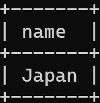
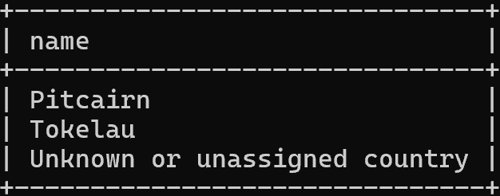

### Exercise 1
select name from country
where iso_country = (
	select iso_country from airport
    where name like "Satsuma%"
);

### Exercise 2
select name from airport
where iso_country = (
	select iso_country from country
    where name = 'Monaco'
)

### Exercise 3
select screen_name from game
where id in (
	select game_id from goal_reached
	where goal_id =(
		select id from goal
		where name = "clouds"
	)
)

### Exercise 4
select name from country
where iso_country not in(
	select iso_country from airport
)

### Exercise 5
select name from goal
where id not in(
select goal_id from goal_reached
where game_id = (
select id from game 
where screen_name = 'Heini'))
