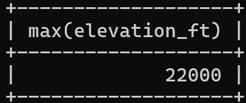
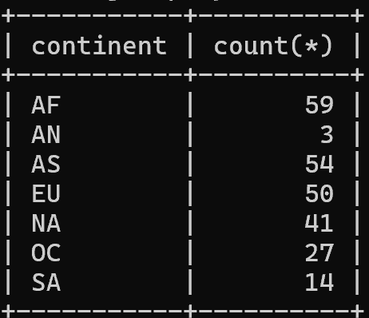
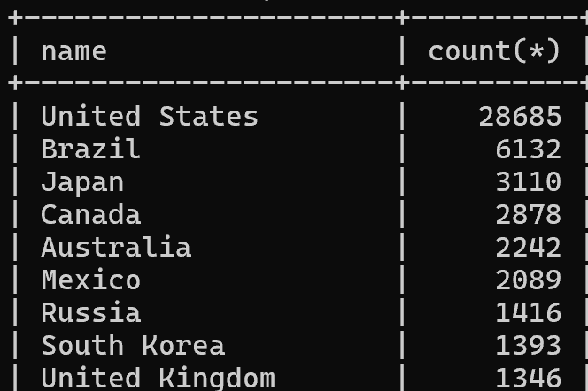
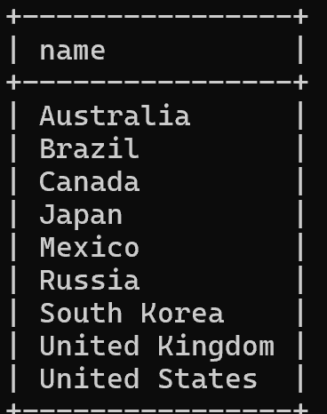
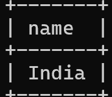
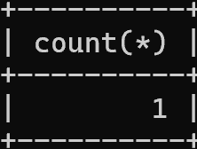
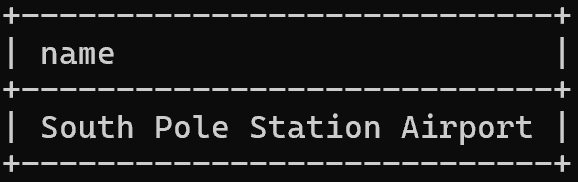

### Exercise 1
SELECT max(elevation_ft) from airport

### Exercise 2
SELECT continent, count(*) from country
group by continent

### Exercise 3
SELECT game.screen_name, count(*) from game, goal_reached
where game.id = goal_reached.game_id
group by game.screen_name

### Exercise 4
select screen_name
from game
where co2_consumed in(
select min(co2_consumed)
from game
);

### Exercise 5
select country.name , count(*) from country, airport
where country.iso_country = airport.iso_country
group by country.name
order by count(*) desc
limit 50;

### Exercise 6
select country.name from country, airport
where country.iso_country = airport.iso_country
group by country.name
having count(*) > 1000;

### Exercise 7
select name from airport
where elevation_ft in(
select max(elevation_ft) from airport)

### Exercise 8
select country.name from country,airport
where country.iso_country = airport.iso_country
and airport.elevation_ft in(
select max(airport.elevation_ft) from airport)

### Exercise 9
select count(*)
from game, goal_reached
where id = game_id and screen_name = "Vesa"
group by screen_name;

### Exercise 10
select name from airport
where latitude_deg in (
select min(latitude_deg) from airport)
